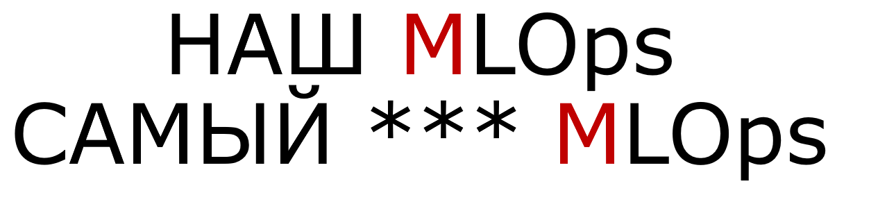
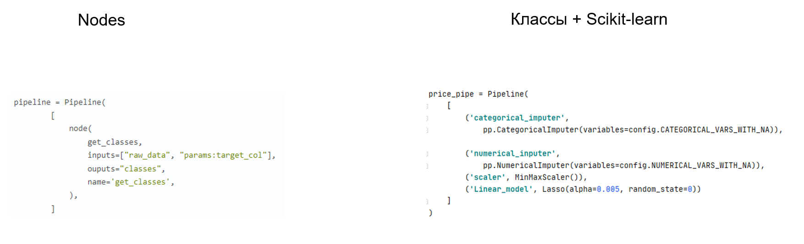
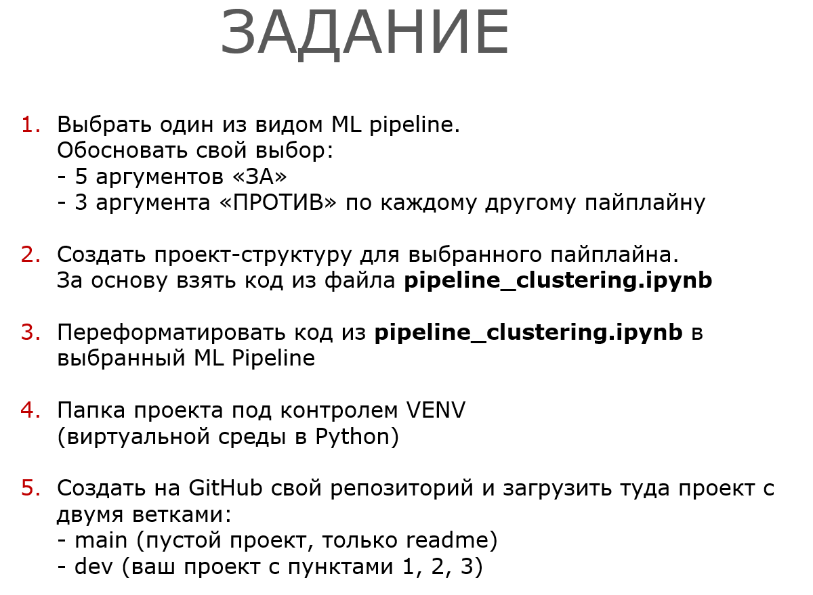

# MLOps

* [Описание](#about)
* [Материал прошедних занятий](#m)
** [Вступление](#intro)
* [Домашнее задание](#hw)
** [Домашнее задание](#hw1)
* [Ветвление (учебное)](#branches)
** [Содержание Main](#bmain)
** [Содержание Dev](#bdev)

 
-----------------------

### Описание

Внутренний курс на развитие компитенций по MLOps и версионированию моделей.

Каждое занятие записывается в плейлист на [YouTube](https://youtube.com/playlist?list=PLO8c9W1gDKfzz5acH7vRQJDVkqsf-gMFf)

**Возможно учавствовать онлайн** с командой Магнита. Для получения расписания и уточнения подробностей пишите в telegram:

__@SeleznevArtem__

 
-----------------------

### Материал прошедних занятий

#### Вступление

Вступительная часть о данном курсе.
Описано расположение материала, краткое вступление по видам pipeline.

Описаны сравнениея между стилями написания кода и структур проектов.

[YouTube](https://youtu.be/UKkoAukIVHg)

 
-----------------------

#### Домашнее задание

##### Домашнее задание 1

 
-----------------------

#### Ветвление (учебное)

 
-----------------------

#### Содержание Main

 
-----------------------

#### Содержание Dev

 
-----------------------
